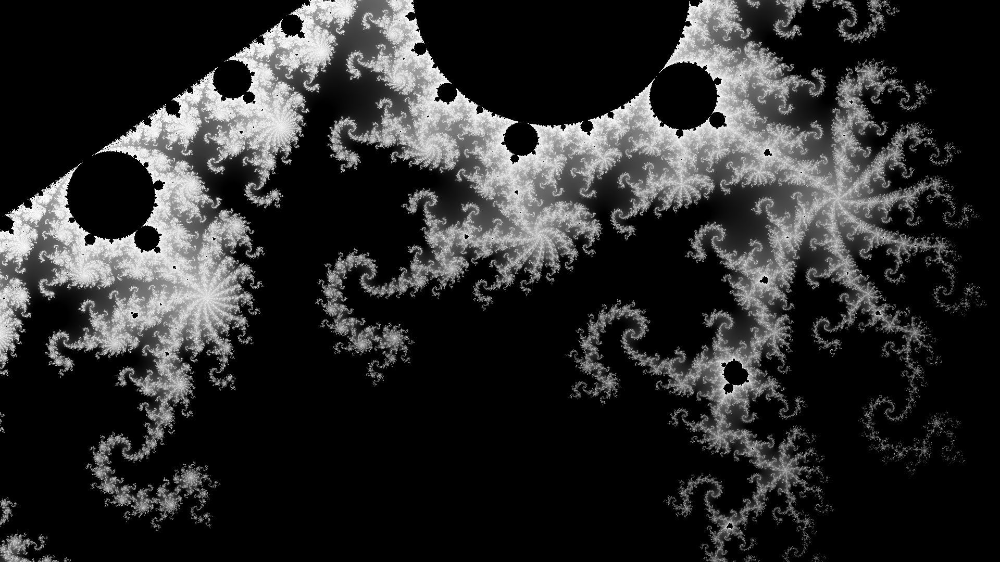
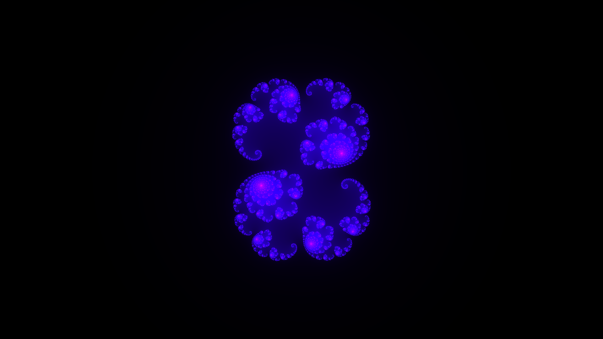
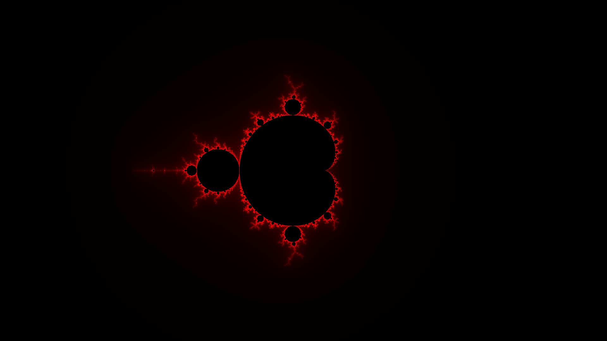

## What is the Mandelbrot set?
The mandelbrot set is the set of complex numbers $c$ for which the function $f_c(z) = z^2 + c$ does not diverge, when iterated from $z = 0$, or remains bounded in absolute value. Its definition is credited to Adrien Douady who named it in tribute to the mathematician Benoit Mandelbrot, a pioneer of fractal geometry. [[1]](https://en.wikipedia.org/wiki/Mandelbrot_set)

The set itself is a very beautiful looking piece of mathematical excelence. The boundary of the Mandelbrot set is an infinitely complicated, recursive fractal curve that one can easily get lost into. Given more iterations, the fractals get finer and finer, and the closer the set is inspected, the more detail and complexity can be found. One can also find countless "minibrots" all over the fractals, which I find just lovely.



## The math used to plot the set

Iterating the function $f(z) = z^2 + c$ starts at $z_0 = 0$, so we use this as an example for looking at how iterating the function looks like:

$z_0 = 0^2 + c$

$z_1 = c^2 + c$

$z_2 = (c^2 + c)^2 + c$

$z_3 = ((c^2 + c)^2 + c)^2 + c$

$...$

We can quickly start seeing a pattern for how the iteration continues until infinity. We take the result from the previous iteration, and add the complex number $c$ to the result. This boils down to calculating the value of $c^2 + c$ every iteration.

Complex numbers can be expressed in the form $c = a + bi$ where $a$ and $b$ are the real components, and $i$ is the imaginary component. If we think about how this can be used in our function, we can see that the expression $c^2 + c$ can be represented as $(a + bi)^2 + (a + bi)$

We can simplify the expression $c^2 = (a + bi)^2$ as follows:

$c^2 = (a + bi)^2$

$c^2 = (a + bi)(a + bi)$

$c^2 = a^2 + abi + abi + b^2$

$c^2 = a^2 + 2abi - b2$

$c^2 = a^2 - b^2 + 2abi$

So at the end, we get the expression $f(a + bi) = a^2 - b^2 + 2abi + a + bi$, which we can reorder into $f(a + bi) = a^2 - b^2 + a + 2abi + bi$ due to the commutative property. Now if we think of using this expression to plot our graph, we can split it to represent the real part $a$ and the imaginary part $bi$ as:

$a = a^2 - b^2 + a$

$bi = 2abi + bi$

Finally, we need to check for the diverging numbers. The formal definition of the Mandelbrot set states that the of $|z_n|$ remains bounded for all $n > 0$. The Mandelbrot set is contained in a disk with a radius of 2 around the origin. We can use this number to check if the value of $z_n$ stays bounded in the set, or if it blows out towards infinity. So to reiterate, if we get a value where $|z^2| > 2$ we know for certain it is outside of the set.

Let's look at two examples, $c = 1$ and $c = -1$:

$c = 1$

$f(0)_0 = 0^2 + 1$

$f(1)_1 = 1^2 + 1$

$f(2)_2 = 2^2 + 1$

$f(5)_3 = 5^2 + 1$

$f(26)_4 = 26^2 + 1$

$...$

When $c = 1$ we can see that the value explodes pretty fast outside of our boundary of 2, so $c = 1$ is not a part of the Mandelbrot set.

$c = -1$

$f(0)_0 = 0^2 + (-1)$

$f(-1)_1 = (-1)^2 + (-1)$

$f(0)_2 = 0^2 + (-1)$

$f(-1)_3 = (-1)^2 + (-1)$

$f(0)_3 = 0^2 + (-1)$

$...$

When $c = -1$ we can see that the value floats in the same range, so $c = 1$ is a part of the Mandelbrot set.

Also, if we look at the $c$ in these examples, we notice it doesn't change as the iteration goes on. so the initial value of $c$ is a constant during the iteration of the function.

An interesting note here, is that if you change the value of $c$ into different constants, you get the visualization of the [Julia set](https://en.wikipedia.org/wiki/Julia_set) instead of the Mandelbrot set. For example $c = 0.285 + 0.01i$ is this Julia set:




Now we have explored all the requred math to actually start looking at how one could program a visualization of the Mandelbrot set.

## The visualization

To plot the Mandelbrot set on a computer screen, we can map the real part $a$ and the imaginary part $bi$ to the screen's $xy$ coordinates as $a = x$ an $bi = y$, which allows us to visualize the set in a 2D grid of pixels, i.e. your screen.

In the previous section we established the iterative calculations for $a$ and $bi$, which we can transform into an $x$ and $y$ representation as:

$x = x^2 - y^2 + x$

$y = 2xy + y$

Another thing that is important to remember: *The Mandelbrot set is contained in a disk with a radius of 2 around the origin.*

So how does one plot an image on a screen that is possibly thousands of pixels? We need to normalize the values of $x$ and $y$ to be $-2 < x < 2$ and $-2 < y < 2$. We can use this function where $a$ is the input values and $b$ is the output values:

$b_{out} = (a - a_{min}) * (b_{max} - b_{min})/(a_{max} - a_{min}) + b_{min}$

If you think about the value range of $x$ and $y$ here, you can see that it forms a with a width and a height of 2. Most monitors and phones are rectangles, which would make our visualization skewed, if we just plot it to a square range. We will need to also normalize the range of $x$ or $y$ to represent a rectangle instead of a square.

Let's use the range of $x$ for this. We'll calculate a new range for $x$ with:

$X_{range} = range * (width / height)$

Which on a 1900 x 1080 pixel screen comes out to $\approx3.519$ instead of our original 2. We can check that this is correct because $\frac{1900}{1080} \approx 1.7595$ and $\frac{2}{3.519} \approx 1.7595$

So now we know all the necessary pre-processing we need to do for our visualization.



### The Code

Harnessing all this knowledge, we can start writing the code. As a refresher, the original representation of the set states that:

*The mandelbrot set is the set of complex numbers $c$ for which the function $f(z) = z^2 + c$ does not diverge, when iterated from $z = 0$*

We know we have to start iterating from 0 and that we need to iterate the function untill infinity. Iterating to infinity is not very practical, so let's replace infinity with a variable amount of iterations, like 64. The complex number $c$ we plotted out to represent our screen's coordinates $x + y$, and we established the necessary calculations to get the value of $x$ and $y$ each iteration. Considering we need to calculate each pixels position relative to the Mandelbrot set, we can do this by looping over all the pixels of our screen.

A common practice is to plot the number of iterations it took to diverge, to some color representation. In this example we use this to make a grayscale representation. We should also clearly visualize the Mandelbrot set itself. We can do that by checking if our loop reaches the iteration limit, and coloring those points black.

Here is an example of the visualization using the HTML canvas element's API with 2D rendering context to make a rendering of the mandelbrot set:

```js
const width = 700;
const height = 500;
const cv = document.createElement("canvas");
cv.width = width;
cv.height = height;
const ctx = cv.getContext("2d");
const buffer = new Uint8ClampedArray(width * height * 4);
const idata = ctx.createImageData(width, height);

const iterations = 64;
const scale = 2;
const xScale = scale * (width / height);

for (let x = 0; x < width; x++) {
	for (let y = 0; y < height; y++) {
		let a = (x * (xScale + xScale)) / width - xScale;
		let b = (y * (scale + scale)) / height - scale;
		const constantA = a;
		const constantB = b;

		let tempA;
		let n = 0;
		for (let i = 0; i < iterations; i++) {
			tempA = a * a - b * b + constantA;
			b = 2 * (a * b) + constantB;
			a = tempA;

			if (a * a + b * b > 4.0) break;
			n++;
		}

		n = n == iterations ? 0 : (n * 255) / iterations;

		pos = (y * width + x) * 4;
		buffer[pos + 0] = n;
		buffer[pos + 1] = n;
		buffer[pos + 2] = n;
		buffer[pos + 3] = 255;
	}
}

idata.data.set(buffer);
ctx.putImageData(idata, 0, 0);

document.body.appendChild(cv);

```

And here's the example code running in a CodePen:

<iframe height="580" style="width: 100%;" scrolling="no" title="YzpaWQZ" src="https://codepen.io/Larqqa/embed/YzpaWQZ?height=580&theme-id=dark&default-tab=js,result" frameborder="no" loading="lazy" allowtransparency="true" allowfullscreen="true">
  See the Pen <a href='https://codepen.io/Larqqa/pen/YzpaWQZ'>YzpaWQZ</a> by larqqa
  (<a href='https://codepen.io/Larqqa'>@Larqqa</a>) on <a href='https://codepen.io'>CodePen</a>.
</iframe>

Now, you could add a lot of things to this example, like a user interface and coloring using something like the HSV color model.

But if you wish to just play around with such an app, here is the Website I developed for it: [Fractal viewer](https://larqqa.github.io/mandelbrot-visualization/).