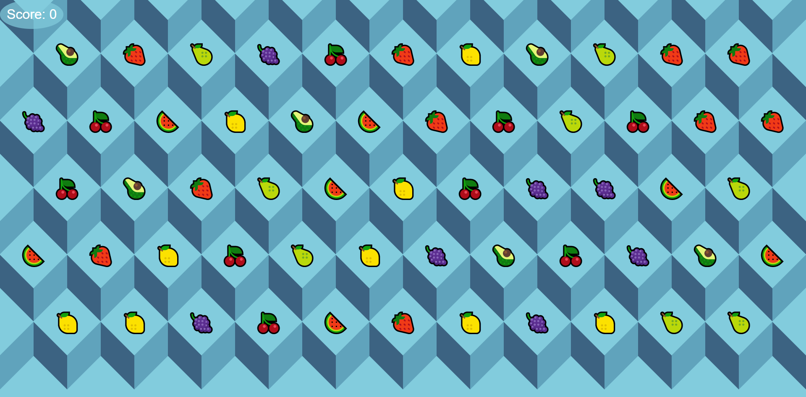

# FRUITS

I saw this cool image of some sneaker product page with an isometric cube grid, and wanted to try making it with CSS.
After finishing the grid with some HTML and CSS, i thought it would make for a cool little game.

I decided to try and continue on the vanilla train, and made the functionality with vanilla javascript.