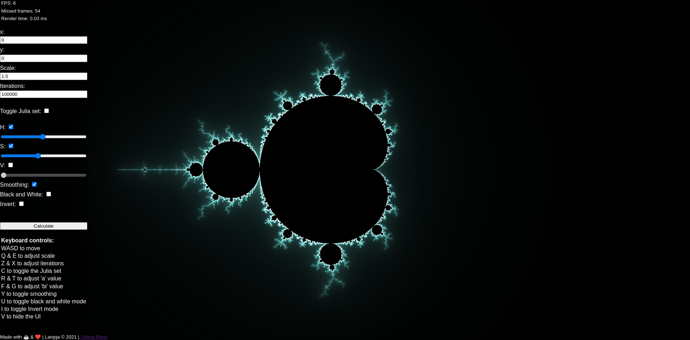

<a href="https://github.com/Larqqa/mandelbrot-visualization" class="icon">
  <i class="fab fa-github"></i>
</a>
<a href="https://larqqa.github.io/mandelbrot-visualization/" class="icon">
  <i class="fas fa-laptop"></i>
</a>

An explanation of the mathematical approach can be found in this blog post: [Plotting the Mandelbrot set](https://larqqa.github.io/blog/ideas/plotting-the-mandelbrot-set/)

This is an app for visualization of the Mandelbrot and Julia sets. These are sets of complex numbers $c$ for which the function $f_c(z)=z^2 + c$ does not diverge.

I made an initial concept version using the basic 2D rendering context, but this required the calculations to be done in JavaScript, which turned out to be *very slow*. I also tried using
WebAssembly, which turned out to be even slower than the 2D context, which might also be caused by my inexperience in Rust.

I then remembered that WebGL exists and decided to redo the project using WebGL, because I wanted to achieve better performance.

The visualization itself is done with JavaScript and WebGL. There are no external libraries used, it's all done with ES6 JavaScript and the Canvas API.

I tried to employ OOP strategies, to write separated modules for the different functionalities. It helped a lot with keeping these modules in check, and with navigating the required WebGL boilerplate. Knowing exactly which file holds which things and having the name reference for these modules at a glance was a massive help. I also liked using OOP for this project, because I could easily link different states and elements within the whole app, while still having maintainable sized code chunks.

I had not used WebGl before this and it was a great experience. I learned a lot about graphicas programming that i had no previous experiences before, like the shaders used by WebGL to pass calculations to the GPU. I also learned about new JavaScript data types, like `Float32Array` which I had not used before.

Another thing I had to get into wraps, was the math required for making the visualization. It helped immensly to have a good grip of what the Mandelbrot set is and how it is actually calculated.
