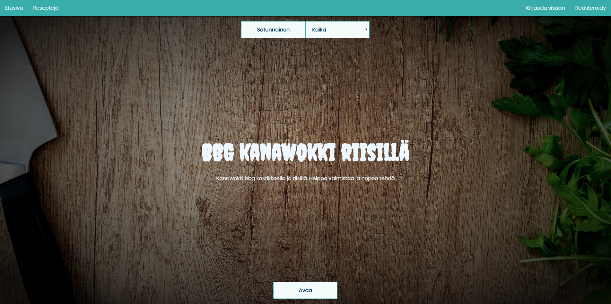

The eternal question "what to eat?" now you can have an easy answer, with Random Recipes!

This website relies on user input recipes, that it then serves randomly to visitors.
This works as a CRUD app with Express server, React front end and mongoDB database.

https://github.com/Larqqa/RESTful-recipes
https://random-resepti.herokuapp.com/